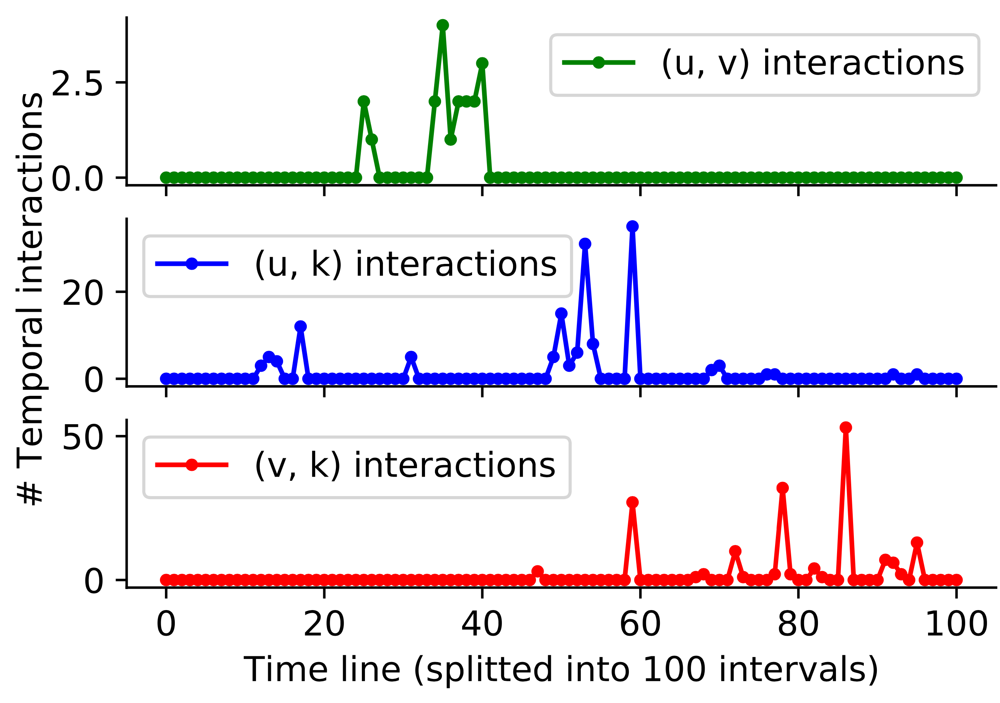
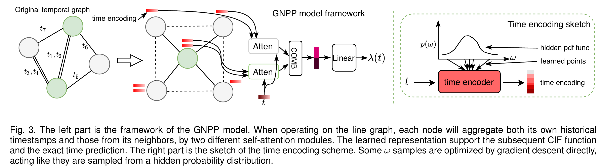

# Graph neural point process for temporal interaction prediction

## Abstract

Temporal graphs are ubiquitous data structures in many scenarios, including social networks, user-item interaction networks, etc. In this paper, we focus on predicting the exact time of the next interaction, given a node pair on a temporal graph. This novel problem can support interesting applications, such as time-sensitive items recommendation, congestion prediction on road networks, and many others. We present Graph Neural Point Process (GNPP) to tackle this problem. GNPP relies on the graph neural message passing and the temporal point process framework. Most previous graph neural models devised for temporal/dynamic graphs either utilize the chronological order information or rely on specific point process models, ignoring the exact timestamps and complicated temporal patterns. In GNPP, we adapt a time encoding scheme to map real-valued timestamps of events to a high-dimensional vector space so that the temporal information can be precisely modeled. Further, GNPP considers the structural information of graphs by conducting message passing aggregation on the constructed line graph. The obtained representation defines a neural conditional intensity function that models events' generation mechanisms for predicting future event times of node pairs. We evaluate this model on several synthetic and real-world temporal graphs where it outperforms some recently proposed neural point process models and graph neural models devised for temporal graphs. We further conduct ablation comparisons and visual analyses to shed some light on the learned model and understand the functionality of important components comprehensively.



Figure 1. Interaction counts of node pairs (u, v), (u, k) and (v, k) of a temporal triangle on a temporal graph. We split the time into 100 intervals and count number of interactions at each interval. We can see that interaction counts of (v, k) increases gradually only after some earlier interactions on (u, v) and (u, k), which indicates that interactions on neighbor node pairs may influence the (v, k) itself.



Figure 2. Framework of the GNPP model.

# Install the module

To run the code, firstly install the module in the editable mode as follows.

```other
git clone https://github.com/xiawenwen49/GNPP-code.git
cd GNPP-code/
pip install -e .
```

## Datasets

We use both real-world datasets and synthetic dataset. The downloading and preprocessing steps are elaborated as follows.

## Real-world data downloading and preprocessing

The three real-world datasets we used can be found in the following links.

Wikipedia: <del>[https://drive.google.com/file/d/1Gt9YvAlDAVgzw8exqSRIn_lucXHDM26q/view?usp=sharing](https://drive.google.com/file/d/1Gt9YvAlDAVgzw8exqSRIn_lucXHDM26q/view?usp=sharing).</del>
[http://snap.stanford.edu/jodie/wikipedia.csv](http://snap.stanford.edu/jodie/wikipedia.csv).


Reddit: <del>[https://drive.google.com/file/d/1LO_nsKewY_fI_94-yrMzZ4Y03duVDrRa/view?usp=sharing](https://drive.google.com/file/d/1LO_nsKewY_fI_94-yrMzZ4Y03duVDrRa/view?usp=sharing).</del>
[http://snap.stanford.edu/jodie/reddit.csv](http://snap.stanford.edu/jodie/reddit.csv).

CollegeMsg: [https://snap.stanford.edu/data/CollegeMsg.html](https://snap.stanford.edu/data/CollegeMsg.html).

> *For the CollegeMsg dataset, simple download and unzip the CollegeMsg.txt in the data/CollegeMsg/ directory.*

> *For the Wikipedia and Reddit dataset, use the data/prepeocessing.py script to process the data files and put them into data/Wikipedia/ and data/Reddit directory correspondingly.*

> *Each dataset should have the data/DATASET_NAME/DATASET_NAME.txt format after preprocessing.*

The downloading and preprocessing steps are as follows.

```other
# Download three dataset files in the directory data/ first.

cd data/
mkdir Wikipedia
mkdir Reddit
mkdir CollegeMsg

python preprocessing.py --dataset Wikipedia
python preprocessing.py --dataset Reddit

mv ./Wikipedia.txt ./Wikipedia/Wikipedia.txt
mv ./Reddit.txt ./Reddit/Reddit.txt
mv ./CollegeMsg.txt ./CollegeMsg/CollegeMsg.txt
```

## Synthetic data generating

The code in gnpp.test elaborates the SyntheticGenerator class, which generates synthetic datasets used in the paper, as shown below.

```python
class TestCase():
    def test_synthetic_generate(self, model_name):
        """ Generate synthetic datasets """
        from gnpp.main import ROOT_DIR
        from gnpp.utils import SyntheticGenerator
        
        # model_name = 'poisson' # hawkes_pos, hawkes_neg, poisson,
        root = ROOT_DIR/'data'/f'Synthetic_{model_name}'
        syn = SyntheticGenerator(root, N=1000, deg=2)
        syn.generate_simulations(model_name=model_name)
```

For example, to test the poisson dataset generation, simply run

```other
python -m gnpp.test --dataset poisson
```

> T*he model_name could be set to hawkes_pos, hawkes_neg, and poisson, i.e., the corresponding three synthetic datasets used in the paper.*

# Running instructions

The running parameters can be set in the run.sh script as follows

```bash
dataset=Wikipedia # Wikipedia, Reddit, CollegeMsg, Synthetic_hawkes_neg, Synthetic_hawkes_pos, Synthetic_poisson
model=GNPP
batch_size=1
epochs=100
gpu=2
num_heads=1
optim=adam
time_encoder_type=he
time_encoder_dimension=128
desc=he

python -m gnpp.main --model ${model} --num_heads ${num_heads} --dataset ${dataset} --epochs ${epochs} --batch_size=${batch_size} \
--gpu ${gpu} --optim ${optim} --time_encoder_type ${time_encoder_type} --time_encoder_dimension ${time_encoder_dimension} \
--desc ${desc}
```

To runt the GNPP model, simply type

```other
./run.sh
```

The gnpp.main will first extract subgraphs from the original temporal graph as data samples and then train and test the model.

Changing the parameters of the script to produce different sections’ results of the paper. For example:

Setting the *dataset* parameter in the script to produce results in the Section 4.3 (synthetic dataset results) and Section 4.4 (real-world datasets results) of the paper.

Setting the *with_neig* to 1 or 0 to produce the comparisons in Section 4.5 of the paper.

More details please refer to the settings in src/gnpp/main.py of the source code.

# Other baselines

We list some of the baselines we used and elaborate our adaptations for these methods as follows.

- THP, [https://github.com/SimiaoZuo/Transformer-Hawkes-Process](https://github.com/SimiaoZuo/Transformer-Hawkes-Process)
- SAHP, [https://github.com/QiangAIResearcher/sahp_repo](https://github.com/QiangAIResearcher/sahp_repo)
- NNPP, [https://github.com/omitakahiro/NeuralNetworkPointProcess](https://github.com/omitakahiro/NeuralNetworkPointProcess)
- TGAT, [https://github.com/StatsDLMathsRecomSys/Inductive-representation-learning-on-temporal-graphs.git](https://github.com/StatsDLMathsRecomSys/Inductive-representation-learning-on-temporal-graphs.git)
- TGN, [https://github.com/twitter-research/tgn](https://github.com/twitter-research/tgn)
- GHNN, [https://github.com/Jeff20100601/GHNN_clean](https://github.com/Jeff20100601/GHNN_clean)
- DySAT, [https://github.com/aravindsankar28/DySAT](https://github.com/aravindsankar28/DySAT)

For three point process models, including THP, SAHP, and NNPP, we could use their default settings. For temporal graphs neural models, including TGAT, TGN, and GHNN, we simplely modify their last output layer from softmax (as they are for multiclass-classification) to a scale output layer, to make them compatible for the focused problem, without affecting their architectures. For embedding based graph models, e.g., DySAT, we use the embedding output of their models (using the temporal graphs before the time poitn of first label timestamp) and train a 2-layer MLP as the predictor for predicting next interaction times.
Note that each of these baselines have their specific input formats, hence a proper format converter is required.
For example, the tgn requires *u v t label feature* input. The *feature* can be padded with 0 if not exists in datasets, and *label* is set to the target prediction time.